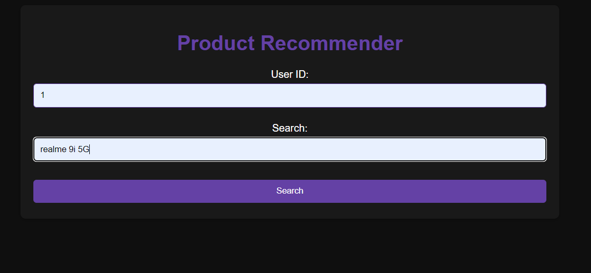
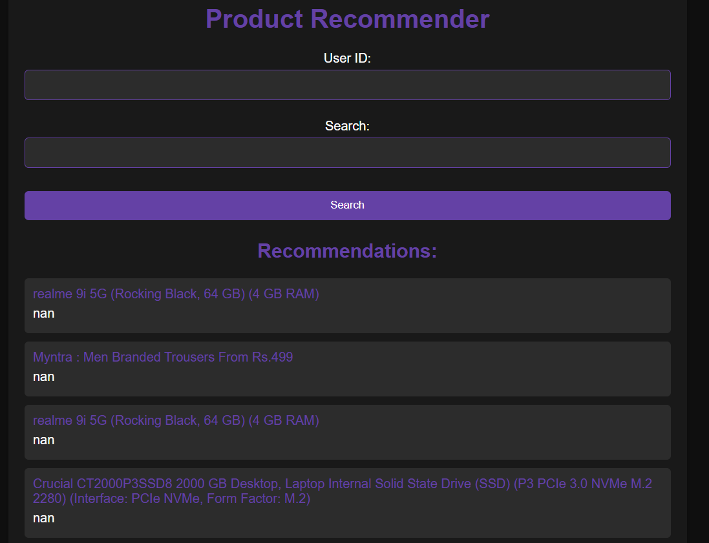
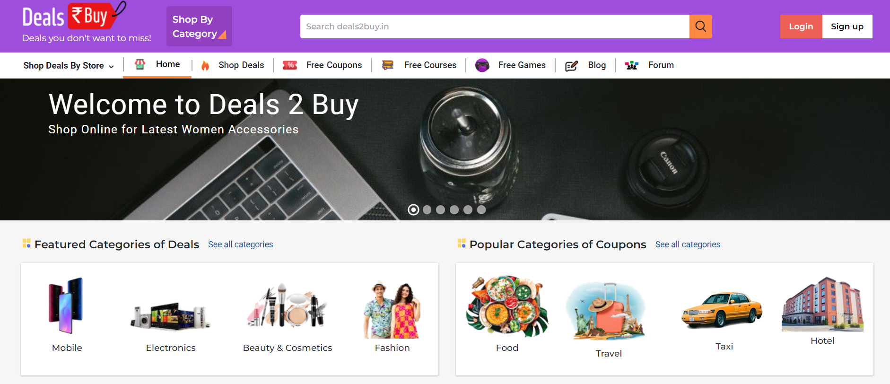

# Product Recommender

Product Recommender is a web application built with Flask that suggests products based on user input and previous searches.

## Overview

This application provides users with personalized product recommendations by leveraging their search history. Users can input their user ID and a search query, and the app will display a list of recommended products based on their input and past interactions with the platform.

## Features

- **Personalized Recommendations:** Utilizes user search history to suggest products tailored to individual preferences.
- **Simple User Interface:** Offers a user-friendly interface for easy navigation and interaction.
- **Responsive Design:** Ensures a seamless experience across different devices and screen sizes.

## Installation

1. Clone the repository:

    ```bash
    git clone <repository-url>
    ```

2. Install dependencies:

    ```bash
    pip install -r requirements.txt
    ```

3. Run the Flask app:

    ```bash
    python main.py
    ```

4. Access the application in your web browser at `http://127.0.0.1:5000`.

## Usage

1. Open the application in your web browser.
2. Enter your User ID and a search query in the respective input fields.
3. Click the "Search" button to receive personalized product recommendations.
4. Explore the recommended products and click on their titles to view more details.

## Technologies Used

- **Flask:** Micro web framework for building web applications with Python.
- **pandas:** Data manipulation and analysis library in Python.
- **scikit-learn:** Machine learning library for Python, used for text vectorization and similarity calculation.
- **Jinja2:** Templating engine for Python, used for rendering HTML templates.

## Contributing

Contributions are welcome! If you have any ideas for improvement, bug fixes, or feature requests, please open an issue or submit a pull request.

## License

This project is licensed under the [MIT License](LICENSE).

# Demo

page 1 search page



Page 2 result page



Page 3 the redirects to lannister server



___________

# Product Recommender
## Overview

The Product Recommender is a Flask-based web application designed to provide personalized product recommendations to users based on their search queries and previous interactions. The application utilizes a pandas DataFrame to store user activity data, such as user IDs, product titles, and breadcrumbs. Here's how the application works:

- Data Loading: The application loads user activity data from a CSV file into a pandas DataFrame. 

- Processing User Input: When a user submits a search query along with their user ID, the application filters the DataFrame to retrieve relevant user activity data. 

- Text Vectorization: Product titles and breadcrumbs are combined into a single text column and transformed into numerical features using TF-IDF vectorization. 

- Calculating Similarity: Cosine similarity is calculated between the user's search input and each product in the filtered DataFrame. 

- Generating Recommendations: The top 5 products with the highest similarity scores are selected as recommendations for the user. 

- Rendering Template: The recommendations are then rendered on the web page along with the user's search input and user ID.

### Usage

#### To use the Product Recommender:

- Ensure you have the necessary dependencies installed. 
- Run the Flask application (main.py). 
- Access the application in your web browser. 
- Enter your user ID and search query. 
- Receive personalized product recommendations based on your input.